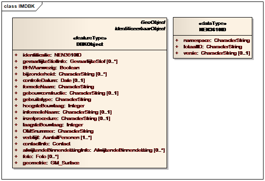
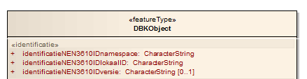
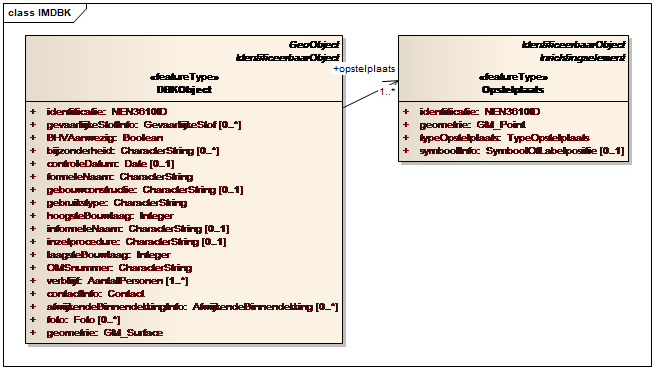
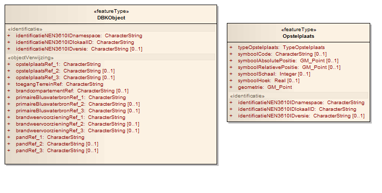

# Geography Markup Language (GML) - Nederlands profiel

Dit hoofdstuk bevat de integrale tekt uit hfd 3 en 4 van de Handreiking Geometrie in model en GML [[HGMG]].

Het Nederlands Basismodel Geo-informatie (NEN 3610) specificeert in overeenstemming met de ISO-geo-informatiestandaarden GML (Geography Markup Language) als uitwisselingsformaat voor geo-informatie. De actuele standaard voor GML wordt gehanteerd. Op dit moment is dat GML 3.2.1 [[iso-19136-2007]], waarbij ook GML 3.1.1 nog ondersteund wordt. Omdat GML 3.2.1 een zeer uitgebreide standaard is wordt er een profiel, een subset gehanteerd.

GML 3.2.1 is een uitgebreide standaard, ontwikkeld door het Open Geospatial Consortium (OGC) en biedt oplossingen voor een groot aantal situaties en variaties voor het uitwisselen van geo-informatie. Variaties zijn er in geometrietypen maar ook in complexiteit van datastructuren. Om verschillende niveaus van toepassing van GML 3.2.1 mogelijk te maken zijn er door OGC zogenaamde profielen gemaakt. De ontwikkeling van de profielen is voortgekomen uit een behoefte van onder meer softwareleveranciers om verschillende niveaus van complexiteit te ondersteunen. Operabiliteit kan daarmee beter gegarandeerd worden. De profielen omvatten elk een subset van de totale GML 3.2.1 standaard. De standaardprofielen zijn Simple Features Profile 0, Simple Features Profile 1 en Simple Features Profile 2 (afgekort tot respectievelijk SF0, SF1, en SF2). Deze profielen hebben een toenemende complexiteit en bieden ook een toenemende functionaliteit. SF0 is dus het eenvoudigst, en SF2 het meest uitgebreid. Het OGC Simple Features profile moet niet verward worden met de ISO 19125 - Simple feature access standaard. De eerste gaat over implementatie van geometrie in GML de tweede over definities van 2 dimensionale geometrietypen.

Een profiel dat meer complexiteit en functionaliteit toestaat, biedt meer mogelijkheden voor datamodellering of geometriebeschrijvingen, maar is ook moeilijker toe te passen in software. Deze complexiteit kan de uitwisseling tussen verschillende softwareplatforms bemoeilijken. Een eenvoudig profiel daarentegen biedt minder mogelijkheden voor datamodellering maar is wel eenvoudiger toe te passen in generieke software. Het is daarom van belang voor- en nadelen tegen elkaar af te wegen. In Nederland is het SF2 profiel op GML van toepassing verklaard.

## Totstandkoming SF2 als Nederlands profiel op GML
Bij het tot stand komen van het Nederlandse GML profiel zijn een aantal beginselen leidend geweest:
- het profiel moet de eisen van het geo-informatie werkveld weerspiegelen;
- het profiel is gekoppeld aan (toepassingen van) NEN 3610;
- het profiel is een basisprofiel dat basiseisen die door de sectorale informatiemodellen gesteld worden omvat;
- een sectoraal informatiemodel kan uitbreidingen op het basisprofiel formuleren;
- het profiel moet afgestemd zijn op de actuele technische mogelijkheden die software biedt.

Door deze beginselen geeft het profiel voldoende richting voor standaardisering van algemene functionaliteit maar ook flexibiliteit voor toepassingen die specifieke oplossingen nodig hebben. Het profiel geeft richting aan de aanbodkant van geo-informatie en aan de modelleurs van informatiemodellen voor de oplossingen en mogelijkheden voor datamodellering. Voor softwaretoepassingen biedt het profiel een basis waar functionaliteit en toepassingen op afgestemd kunnen worden.

Om een uitspraak te kunnen doen over de eisen die in Nederland gesteld worden aan GML als uitwisselingsstandaard is een enquête gehouden onder de beheerders van aan NEN 3610 gerelateerde informatiemodellen. De volgende informatiemodellen
en hun respectievelijke sectoren zijn hier bij betrokken: BAG (adressen en gebouwen), IMGeo (geografie), IMWA, UM Aquo-m, UM Aquo-krw (water), TOP10NL/IMTOP (topografie), GBR (grootschalig weg, water en waterwegen), IMWE (welstand), IMRO (ruimtelijke ordening), IMKICH (cultuurhistorie), IMKAD (kadaster), IMKL, BMKL (kabels en leidingen), IMBOD (bodem). Op basis van deze
eisen is een eerste concept profiel voor GML ontwikkeld.

Het conceptprofiel is gepresenteerd aan en voor commentaar uitgebracht naar het hele geo-informatie werkveld. Een belangrijke rol was hierin voor softwareleveranciers en –ontwikkelaars om eisen vanuit de toepassingen in het profiel te verwerken. Het conceptprofiel is gepubliceerd onder de werknaam gml4nl en was op het moment van publicatie gebaseerd op GML 3.1.1.

Bij de ISO publicatie van GML 3.2.1 is ook het Nederlandse profiel vernieuwd. Het Nederlandse profiel bleek daarbij zo weinig van het GML SF2 profiel te verschillen dat besloten is om geen apart Nederlands profiel te publiceren maar SF2 als officieel Nederlandse profiel op GML 3.2.1 te volgen. Belangrijk was daarin dat het huidige SF2 profiel, in tegenstelling tot 3.1.1 SF2, ook cirkels en bogen opgenomen heeft als geometrievormen.

##  GML Simple Features profielen en data complexiteit

De GML standaard is een omvangrijke verzameling van XML elementen en attributen waarmee van alles mogelijk is. De GML standaard bevat bijvoorbeeld definities voor dynamische (voortdurend veranderende) objecten, topologie, complexe geometrische typen, en rasters. Dit maakt GML tot een rijke standaard die veel te bieden heeft, maar maakt het ook moeilijker voor software aanbieders om de hele standaard te ondersteunen.

Om dit probleem te adresseren zijn er verschillende profielen op GML gedefinieerd door de OGC. Een GML profiel is een subset van de complete GML set. De subset is wel zodanig dat het profiel niet in tegenspraak is met de complete set. Voor GML 3.2.1 zijn er drie profielen met toenemende complexiteit, de zogenaamde Simple Features profielen. Softwareleveranciers kunnen ervoor kiezen hun ondersteuning van GML te beperken tot een van deze profielen, of uiteraard om de hele standaard te ondersteunen.

Wat is nu een “simple feature”? Een feature is in de context van GML een equivalent van een instantie van een objecttype zoals bijvoorbeeld een gebouw, een boom, een persoon, een ding. Deze instanties hoeven niet noodzakelijkerwijs een geometrie, of locatie-informatie te hebben. Met ‘simple’ wordt in deze context bedoeld dat de features:

- Een eenvoudige datastructuur hebben.

- Als het ruimtelijke objecten zijn, een eenvoudige geometrische vorm hebben.

De GML standaard is gebaseerd op de algemene XML standaard XML Schema [[xmlschema-0]]. Een deel van de regels uit de simple features profielen hebben hier betrekking op. SF0 beperkt bijvoorbeeld de datatypen uit XML Schema die gebruikt mogen worden
(string, boolean, etc) en definieert daarmee in feite ook een subset van XML Schema. Dit geldt voor de meeste regels die betrekking hebben op de eenvoud van de datastructuur.

Wat er precies wordt beschouwd als ‘eenvoudig’, oftewel wat er wel en niet is toegestaan, wordt gespecificeerd in de GML Simple Features Profile standaard [[GML-SF]].

## Regels voor alle Simple Features profile levels

De volgende tabel uit het OGC document Geography Markup Language (GML) simple
features profile, geeft een overzicht van de inhoud van de verschillende
profielen.

### Inhoud SF niveau’s

|                                                    | **SF-0**                                                       | **SF-1**                                                       | **SF-2**                                               |
|----------------------------------------------------|----------------------------------------------------------------|----------------------------------------------------------------|--------------------------------------------------------|
| Beperkte set van ingebouwde niet ruimtelijke typen | String, integer, measurement, date, real, binary, boolean, URI | String, integer, measurement, date, real, binary, boolean, URI | Geen beperking                                         |
| Beperkte set van geometrietypen[^3]                | (multi)Punt, (multi)lijn, (multi)vlak,(multi) geometry         | (multi)Punt, (multi)lijn, (multi)vlak,(multi) geometry         | (multi)Punt, (multi)lijn, (multi)vlak,(multi) geometry |
| Zelf ontwikkelde datatypen                         | nee                                                            | ja                                                             | ja                                                     |
| Gebruik van nillable en xsi:nil                    | nee                                                            | ja                                                             | ja                                                     |
| Cardinaliteit(multipliciteit)                      | 0 of 1                                                         | 0 tot onbeperkt                                                | 0 tot onbeperkt                                        |
| Niet-ruimtelijke referenties                       | Ja, Alleen by reference (gml:ReferenceType)                    | Ja By reference (gml:ReferenceType) of inline                  | Ja By reference en inline in combinatie is mogelijk.   |
| Ruimtelijke referenties                            | Ja, Alleen by reference (gml:ReferenceType)                    | Ja Alleen by reference (gml:ReferenceType)                     | Ja By reference en inline in combinatie is mogelijk.   |

<a href="#geometrietypen">Tabel 2</a> geeft meer detail over de toegestane geometrietypen.

Het is toegestaan samengestelde (geaggregeerde) geometrie te gebruiken, te weten MultiPoint, MultiCurve, MultiSurface, en MultiGeometry. Hierbinnen geldt dat alleen de enkelvoudige container elementen mogen worden gebruikt. Dus wel: `gml:pointMember` maar niet: `gml:pointMembers` enzovoort.

Voor **alle niveau’s (SF0, SF1 en SF2)** geldt bovendien dat de volgende GML onderdelen in het Simple Features profile **niet** worden ondersteund:

- Rasters (coverages)
- Topologie
- Tijd en dynamische features
- Observaties/metingen

Verder geldt:

- Het gebruik van Gml:metadataProperty is niet toegestaan. Men moet indien nodig zelf metadata elementen definiëren in een GML application schema.
- In het GML application schema moet het compliance level op de voorgeschreven manier (zie paragraaf 3.7) worden aangegeven.
- In het GML application schema moet het volledige GML schema geïmporteerd worden (gml.xsd).
- Een GML application schema mag maximaal één feature collection op de voorgeschreven manier (zie paragraaf 3.3.1) definiëren.

### Feature collecties

Een GML document is gedefinieerd als één feature collectie, een verzameling van geo-objecten. Deze collectie krijgt een eigen naam gedefinieerd in het XML-Schema. Een GML document begint met de declaratie van deze collectie in het root element. Er wordt geen gebruik gemaakt van de container `gml:featureMembers` en de individuele `gml:featureMember`. Deze elementen zijn komen te vervallen vanaf GML versie 3.2.

Voorbeeld XSD fragment:

<pre class="example">
&lt;element name="FeatureCollectionIMRO" type="imro:FeatureCollectionIMROType" 
            substitutionGroup="gml:AbstractGML"/>
&lt;complexType name="FeatureCollectionIMROType">
  &lt;complexContent>
    &lt;extension base="gml:AbstractFeatureType">
      &lt;sequence minOccurs="0" maxOccurs="unbounded">
        &lt;element name="featureMember">
          &lt;complexType>
            &lt;complexContent>
              &lt;extension base="gml:AbstractFeatureMemberType">
                &lt;sequence>
                  &lt;element ref="gml:AbstractFeature"/>
                &lt;/sequence>
              &lt;/extension>
            &lt;/complexContent>
          &lt;/complexType>
        &lt;/element>
      &lt;/sequence>
    &lt;/extension>
  &lt;/complexContent>
&lt;/complexType>
</pre>

Voorbeeld GML fragment:

<pre class="example">
&lt;imro:FeatureCollectionIMRO gml:id="Collectie"
    xmlns:imro="http://www.geonovum.nl/imro2012"  
    xmlns:xlink=<http://www.w3.org/1999/xlink>xmlns:gml="http://www.opengis.net/gml/3.2"  
    xmlns:xsi="http://www.w3.org/2001/XMLSchema-instance"  
    xsi:schemaLocation="http://www.geonovum.nl/imro2012 IMRO2012.xsd"\>
  &lt;imro:featureMember>
    &lt;imro:Bestemmingsplangebied gml:id="NL.IMRO.0999.BP2008000001-0005">
         ...
    &lt;/imro:Bestemmingsplangebied>
  &lt;/imro:featureMember>
  &lt;imro:featureMember>
    &lt;imro:Enkelbestemming gml:id="NL.IMRO.135">
         ...
    &lt;/imro:Enkelbestemming>
  &lt;/imro:featureMember>
  ...
&lt;/imro:FeatureCollectionIMRO>
</pre>

### Geometrietypen

GML Simple Feature Profile staat een beperkte subset van geometrietypen uit GML toe. Deze subset is voor SF0, SF1, en SF2 gelijk.

<em>Tabel 2: Geometrietypen</em>. Van elk type is ook het equivalent in UML gegeven (Spatial Schema):

| **In GML**        | **UML equivalent** | **Restricties**                                                                                                                                                                                                                                    | **Welk GML Schema document**                 |
|-------------------|--------------------|----------------------------------------------------------------------------------------------------------------------------------------------------------------------------------------------------------------------------------------------------|----------------------------------------------|
| `gml:Point`         | GM_Point           | geen                                                                                                                                                                                                                                               | geometryBasic0d1d.xsd                        |
| `gml:Curve`         | GM_Curve           | `gml:LineString` of `gml:Curve` met `gml:LineStringSegment`, `gml:Arc`, `gml:Circle` of `gml:CircleByCenterPoint`                                                                                                                                              |                                              |
| `gml:Surface`       | GM_Surface         | ondersteund wordt: `gml:Polygon` of `gml:Surface` met `gml:PolygonPatch` patches. Surface grenzen kunnen beschreven worden met `gml:LinearRing` of `gml:Ring` met enkele `gml:Curve` met `gml:LineStringSegment`, `gml:Arc`, `gml:Circle` of `gml:CircleByCenterPoint` | geometryBasic0d1d.xsd geometryPrimitives.xsd |
| `gml:Geometry`      |                    | ondersteund wordt: `gml:Point`, `gml:LineString`, `gml:Curve`, `gml:Polygon`, `gml:Surface`, `gml:MultiPoint`, `gml:MultiCurve`, `gml:MultiSurface`                                                                                                                 | geometryBasic0d1d.xsd                        |
| `gml:MultiPoint`    |                    | geen                                                                                                                                                                                                                                               | geometryAggregates.xsd                       |
| `gml:MultiCurve`    |                    | zelfde als `gml:Curve`                                                                                                                                                                                                                               | geometryAggregates.xsd                       |
| `gml:MultiSurface`  |                    | zelfde als `gml:Surface`                                                                                                                                                                                                                             | geometryAggregates.xsd                       |
| `gml:MultiGeometry` |                    | zelfde als `gml:Geometry`                                                                                                                                                                                                                            | geometryAggregates.xsd                       |

Specificatie van coördinaten:

Voor `gml:point` en `gml:CircleByCenterPoint` is dit middels het `gml:pos` element. Voor alle ander typen is het de `gml:posList`.

### Coördinaatreferentiesysteem

In het Simple Features profiel wordt aanbevolen om het coördinaatreferentiesysteem (CRS) van de in een GML document aanwezige
coördinaten in het GML document op te nemen. In clausule 9 van NEN 3610:2011 wordt dit zelfs verplicht gesteld.

In het GML bestand dient het coördinaatreferentiesysteem opgenomen te worden als waarde van het in GML gedefinieerde attribuut `srsName`. Aangeraden wordt om dit zo generiek mogelijk te doen. Als alle coördinaten in het document hetzelfde CRS hebben, zou het `srsName` attribuut op het niveau van de feature collection moeten worden opgenomen. Anders kan `srsName` worden opgenomen op feature member niveau of op geometrie niveau.

Voor het definiëren van het coördinaatreferentiesysteem kunnen <a href="http://www.epsg.org/">EPSG (European Petroleum Survey Group)</a> codes worden gebruikt.

<pre class="example">
&lt;wfs:FeatureCollection>
  &lt;gml:boundedBy>
    &lt;gml:Envelope srsName="urn:opengis:def:crs:EPSG::28992">...&lt;/gml:Envelope>
  &lt;/gml:boundedBy>
  &lt;!-- feature instances go here -->
  &lt;wfs:member>
    &lt;myns:MyFeature>
      &lt;gml:boundedBy>
        &lt;gml:Envelope srsName="...">...&lt;/gml:Envelope>
      &lt;/gml:boundedBy>
      &lt;!-- zero or more property values go here -->
      &lt;myns:geomProperty>
        &lt;gml:Polygon srsName="...">...&lt;/gml:Polygon>
      &lt;/myns:geomProperty>
      &lt;!-- zero or more property values go here -->
    &lt;/myns:MyFeature>
  &lt;/wfs:member>
  &lt;!-- more feature instances go here -->
&lt;/wfs:FeatureCollection>
</pre>

### Container elementen voor samengestelde geometrietypen

Geometrietypen die zijn samengesteld fungeren als een container (aggregatie) voor de verschillende individuele geometrie elementen. De volgende container elementen zijn toegestaan.

<em>Tabel 3: Samengestelde geometrietypen</em>

| Samengesteld geometrie type   | Container element    |
|-------------------------------|----------------------|
| `gml:MultiPoint`              | `gml:pointMember`    |
| `gml:MultiCurve`              | `gml:curveMember`    |
| `gml:MultiSurface`            | `gml:surfaceMember`  |
| `gml:MultiGeometry`           | `gml:geometryMember` |

### Lijninterpolaties

Het type lijninterpolatie beschrijft hoe de verbinding tussen twee coördinaatparen (punten) is beschreven. In de GML standaard is hiervoor een uitgebreid aantal mogelijkheden. Het Simple Features profiel ondersteunt hiervan maar twee:lineaire interpolatie en interpolatie door middel van cirkelbogen. Deze laatste niet lineaire interpolatie was geen onderdeel van het SF profiel van de vorige GML versie (3.1). Vanwege het toegenomen gebruik in applicaties zijn ze nu wel toegevoegd.

In de tabel in paragraaf 3.3.2 is precies te zien welke typen lijninterpolatie zijn toegestaan door te kijken naar de restricties bij `gml:Curve` en `gml:Surface`. Toegestaan voor het opnemen van rechte lijnen zijn alleen gml:LineString en `gml:Curve` met `gml:lineStringSegments`. Voor het opnemen van bogen zijn alleen `gml:Arc`, `gml:Circle` en `gml:CircleByCenterPoint` toegestaan. `gml:Arc` is de GML implementatie van de cirulaire boog met drie punten (beginpunt, eindpunt en punt waar de boog doorheen loopt).

De overige typen lijninterpolatie, zoals `gml:CubicSpline`, `gml:ArcByBulge`, etc, zijn niet toegestaan.

## Simple features profile 0 (SF0)

SF0 is het meest eenvoudige profiel op GML, m.a.w. het profiel met de meeste restricties op GML en XML Schema.

Regels:

<ul>
    <li>Waarden van een eigenschap mogen inline (genest) of door verwijzing worden opgenomen. Er moet wel een keuze gemaakt worden voor éen van de twee manieren: het is niet toegestaan om in een SF0 GML document de ene keer een waarde inline op te nemen en een andere keer te verwijzen. Verwijzingen mogen alleen opgenomen worden met <code>gml:ReferenceType</code>. Het <code>gml:ReferenceType</code> is de simpele GML implementatie van in UML als associaties gemodelleerde koppelingen tussen objecttypen. De naam van de gekoppelde bron (objecttype) wordt opgenomen in een appinfo element, zodat te zien is naar wat voor soort ding er gerefereerd wordt. De daadwerkelijke verwijzing naar een object instantie wordt met <code>xlink:href</code> gedaan.</li>
    <li>Beperkte set van ingebouwde niet-geometrische typen. Andere eenvoudige of samengestelde typen uit XML Schema of zelf gedefinieerd, zijn niet toegestaan, alleen de volgende:
    <ol>
        <li>String:
        <ol>
            <li>Een element dat een alfanumerieke waarde heeft moet zijn van het XML Schema type <code>string</code> of een restrictie  daarvan. De <code>maxLength</code> of <code>length</code> mogen worden gebruikt om de string verder in te perken.</li>
        2. Een element dat een alfanumerieke waarde heeft waarvan de taal moet worden aangegeven, moet hiervoor gebruik maken van het <code>xml:lang</code> attribuut waarin de taalcode is opgegeven.</li>
        </ol>
        </li>
        <li>Integer: Een element met een integer waarde moet zijn van het XML Schema-type <code>integer</code> of een restrictie daarvan. In het <code>totalDigits</code> element kan worden aangegeven hoe lang het getal mag zijn.</li>
        <li>Measurement: Een element dat een meting als waarde heeft moet van het type <code>gml:MeasureType</code> zijn of zijn afgeleid.</li>
        <li>Date: Een element dat een datum als waarde heeft, moet zijn van een van de XML Schema typen <code>date</code> of <code>dateTime</code> of een restrictie daarvan.</li>
        <li>Real: Een element dat een real waarde moet bevatten, moet zijn van een van de XML Schema typen <code>double</code> of <code>decimal</code> of een restrictie daarvan. Bij een decimal mogen de facetten <code>totalDigits</code> en <code>fractionDigits</code> worden opgegeven, bij een double niet. Meestal zullen elementen met real waarden overigens metingen zijn en dus met een <code>gml:MeasureType</code> worden opgenomen.</li>
        <li>binary: Een element dat een binaire inhoud heeft, moet dit ofwel inline in het GML bestand coderen met het XML Schema type <code>base64Binary</code> of <code>hexBinary</code>; of ernaar verwijzen met een URL. In elk geval is het opnemen van de <code>mimeType</code> verplicht.</li>
        <li>boolean: Een element dat een boolean (ja/nee) waarde heeft, moet van het XML Schema type <code>boolean</code> zijn.</li>
        <li>URI: een element dat een URI als waarde heeft, moet van het XML Schema type <code>anyURI</code> zijn.</li>
    </ol>
    </li>
    <li>De niet geometrische typen mogen qua waarde verder alleen ingeperkt worden met de XML Schema facetten <code>minInclusive</code>, <code>minExclusive</code>, <code>maxInclusive</code>, <code>maxExclusive</code>, en <code>enumeration</code>. Hiermee kan men de minimale en maximale waarden van getallen inperken en enumeraties definiëren.</li>
    <li>Een element eigenschap mag niet meerdere keren voorkomen; de kardinaliteit die mag worden opgegeven is beperkt tot 0 of 1.</li>
    <li>Het XML Schema attribuut <code>nillable</code> mag niet gebruikt worden.</li>
    <li>Het aantal toegestane GML geometrie typen is ingeperkt. Dit is dezelfde subset voor SF0, SF1, en SF2; zie .</li>
    <li>Features mogen meerdere geometrische eigenschappen hebben.</li>
</ul>

## Simple features profile 1 (SF1)

SF1 kent minder restricties dan SF0 en is dan ook iets complexer.

SF1 neemt de regels van SF0 over, met uitzondering van het volgende:

- Het is toegestaan om eigen datatypen te maken met een eenvoudige waarde, maar wel gebaseerd op de set van toegestane niet-geometrische typen uit SF0.
- Het is toegestaan om samengestelde datatypen te maken die een eigen, geneste structuur hebben.
- Eigenschappen mogen meerdere keren voorkomen.
- Het XML Schema attribuut `nillable` mag gebruikt worden.

### Zelf ontwikkelde datatypen: geneste inhoud.

In SF1 en SF2 kan een geneste structuur van attributen toegepast worden. Attributen kunnen daarbij samengesteld worden uit een verzameling attributen. We noemen deze constructie het samengesteld attribuut.

Een voorbeeld is een attribuut met de naam ‘identificatie’ en een datatype ‘identifier’. Het datatype bestaat vervolgens uit drie attributen ‘identificatiecode’, ‘organisatie’, ‘versie’. Het attribuut ‘identificatie’ is in dit geval samengesteld uit drie andere attributen, verenigd in het zelfgemaakte datatype ‘identifier’.

In een GML application schema ziet die constructie als volgt uit:

<pre class="example">
&lt;complexType name="IdentifierPropertyType">
  &lt;sequence>
    &lt;element ref="fw:Identifier"/>
  &lt;/sequence>
&lt;/complexType>
&lt;element name="Identifier">
  &lt;complexType>
    &lt;sequence>
      &lt;element name="identificatiecode" type="string"/>
      &lt;element name="organisatie" type="string" minOccurs="0" maxOccurs="1"/>
      &lt;element name="versie" type="string" minOccurs="0" maxOccurs="1"/>
    &lt;/sequence>
  &lt;/complexType>
&lt;/element>
</pre>

## Simple features profile 2 (SF2)

SF2 is het minst restrictieve niveau in het profiel en is geschikt voor geavanceerde informatiemodellen. Vergeleken met SF1 vervallen in SF2 alle regels over het definiëren van niet-geometrische eigenschappen. D.w.z. alle typen uit de XML Schema standaard mogen gebruikt worden, eigen eenvoudige en samengestelde typen mogen worden gedefinieerd, er zijn geen restricties op kardinaliteit, etc.

Waarden van een eigenschap mogen in SF2 inline (genest) of door verwijzing worden opgenomen. Een mix van beide mag gebruikt worden en gebruik van `gml:ReferenceType` is niet verplicht.

Wel blijft de restrictie op de toegestane geometrietypen gelden, net als de regel over het definiëren van feature collecties.

## Schema compliance: data levering – data ontvangen

Het Simple Features profile van GML 3.1 was in technisch opzicht een gestripte versie van de volledige GML XSD. Dit bleek echter bij veel validatietools problemen op te leveren. De gestripte XSD had dezelfde namespace als de volledige GML XSD waardoor conflicten konden optreden.

Bij het Simple Features profile van GML 3.2 is daarom een andere werkwijze gekozen. Een GML applicatieschema dat voldoet aan een bepaald level van het Simple Features profile, moet hoewel de GML standaard niet volledig hoeft te worden ondersteund, de volledige GML XSD en de gmlsfLevels.xsd importeren en in de header aangeven welk SF level is toegepast. Dit dient te gebeuren door een annotation op te nemen binnen het schema element:

<pre class="example">
&lt;schema xmlns="http://www.w3.org/2001/XMLSchema"
        xmlns:gmlsf="http://www.opengis.net/gmlsf/2.0">
  &lt;import namespace="http://www.opengis.net/gml/3.2"
          schemaLocation="http://schemas.opengis.net/gml/3.2.1/gml.xsd"/>
  &lt;import namespace="http://www.opengis.net/gmlsf/2.0"
          schemaLocation="http://schemas.opengis.net/gmlsfProfile/2.0/gmlsfLevels.xsd"/>
  &lt;annotation>
    &lt;appinfo source="http://schemas.opengis.net/gmlsfProfile/2.0/gmlsfLevels.xsd">
      &lt;!--hier een 0, 1 of 2 invullen-->
      &lt;gmlsf:ComplianceLevel>2&lt;/gmlsf:ComplianceLevel>
    &lt;/appinfo>
  &lt;/annotation>
  ...
&lt;/schema>
</pre>

In plaats van een absolute URL naar de locatie van de schema’s in de schema repository van de OGC, is het ook toegestaan een absolute of relatieve URL naar een andere locatie te gebruiken, zolang het schema maar opgehaald kan worden.

Het is toegestaan om andere application schema’s te importeren, maar alleen als die voldoen aan hetzelfde Simple Features profile niveau of een lager niveau (en dus minder complex zijn) en dit op de voorgeschreven manier aangeven in de header.

Om te controleren of een GML bestand voldoet aan de regels van het Simple Features profile, kan de GML xsd niet worden gebruikt omdat er geen gestripte versie meer beschikbaar is. In plaats daarvan wordt aangeraden om een <a href="http://www.schematron.com/">Schematron</a> validatie te gebruiken. Voor SF2 is een document met Schematron regels beschikbaar in Annex E van het Simple Features profile for GML. Deze regels zijn beschreven in het volgende hoofdstuk, en zijn als validatie ook <a href="http://schemas.opengis.net/gmlsfProfile/2.0/gmlsfL2.sch">beschikbaar in de schema repository van de OGC</a> en de <a href="http://validatie.geostandaarden.nl">online validator van Geonovum</a>.

## GML SF2: Nederlands profiel op GML 3.2

Vanwege de voordelen van voldoen aan internationale conventies en omdat het GML Simple Features profile level 2(SF2) bijna voldoet aan de eisen die er in Nederland gesteld worden is er besloten om SF2 als Nederlandse standaard voor de implementatie van GML 3.2.1 te nemen. In het vorige hoofdstuk is de inhoud van dat profiel toegelicht. In dit hoofdstuk wordt het profiel beschreven middels businessrules die van toepassing zijn op een GML document dat voldoet aan SF 2. De businessrules zijn opgesteld in Schematron, een taal ontwikkeld voor het valideren van XML documenten.

### Introductie Schematron

Schematron gaat in tegenstelling tot XML Schema niet uit van een definitie van de complete XML structuur van een set documenten, maar stelt in staat om regels op te stellen voor specifieke onderdelen van XML documenten. Schematron kan daardoor gebruikt worden om heel gericht enkele regels te controleren. Voor het opstellen van de regels zijn er veel mogelijkheden, waaronder het toetsen van onderlinge afhankelijkheden tussen onderdelen van de XML structuur, wat met XML Schema niet mogelijk is. Terwijl XML Schema te vergelijken is met UML, is Schematron verwant aan de Object Constraint Language (OCL). Beide zijn de implementatie van hun meer conceptuele equivalent.

De in Schematron opgestelde regels kunnen voor validatie van XML (GML) documenten worden gebruikt. Een deel van de bekende XML editors kan validaties tegen Schematron regels uitvoeren of de Schematron controle kan worden uitgevoerd als XSLT transformatie. Validatie tegen de Schematron implementatie van SF2 kan ook <a href="http://validatie.geostandaarden.nl/etf-webapp/testruns/create-direct?testProjectId=8089ca7a-8722-3119-9ec9-661205a743f4">via de Geonovum validator</a> worden uitgevoerd.

De nu volgende paragraaf geeft de Schematron regels die voor het valideren tegen GML SF2 zijn opgesteld. Door de toelichting bij elke regel wordt duidelijk gemaakt hoe op dat bepaalde onderwerp SF2 verschilt van de complete GML standaard.

### Schematron business rules voor Nederlands profiel

De hieronder weergegeven business rules omvatten alleen de SF2 regels. De controle beperkt zich tot met name de restricties met betrekking tot geometrietypen. De restricties op XML Schema, die voor SF0 en SF1 gelden, zijn niet opgenomen. Deze Schematron regels kunnen echter wel gebruikt worden om tenminste de geometrie restricties voor een SF0 of SF1 bestand te valideren. Deze zijn immers voor SF0, SF1 en SF2 gelijk.

Deze schematron regels zijn ontleend aan het OGC Simple Feature Profile for GML. De nieuwste versie is te vinden op
http://schemas.opengis.net/gmlsfProfile/2.0/.

**Geen gebruik van gml:metaDataProperty.**

<pre>
&lt;sch:assert test="not(gml:metaDataProperty)">
    This profile prohibits use of gml:metaDataProperty elements for referencing metadata 
    in instance documents.
&lt;/sch:assert>
</pre>

**Geen topologie elementen**

Geen voorkomens van `Node`, `Edge`, `Face`, `TopoSolid`, `TopoPoint`, `TopoCurve`, `TopoSurface`, `TopoVolume`, or `TopoComplex`.

<pre>
&lt;sch:assert test="not(
    self::gml:Node|self::gml:Edge|self::gml:Face|self::gml:TopoSolid |self::gml:TopoPoint|
    self::gml:TopoCurve|self::gml:TopoSurface |self::gml:TopoVolume|self::gml:TopoComplex)">
        Spatial properties are limited to the set of geometric types consisting of point,
        curve with linear and/or circular arc interpolation, planar surface, or aggregates
        thereof. Spatial topology is excluded.
&lt;/sch:assert>
</pre>

**Interpolatie van curve segmenten**

Toegestaan binnen een `gml:Curve` zijn `LineStringSegment`, `Arc`, `Circle`, or `CircleByCenterPoint`

<pre>
&lt;sch:assert test="not(
    self::gml:Curve) or self::gml:Curve/gml:segments[gml:LineStringSegment|gml:Arc|gml:Circle|
    gml:CircleByCenterPoint]">
        Curves (standalone or within surfaces) must have linear and/or circular arc interpolation 
        (LineString, Curve with Arc, Circle or CircleByCenterpoint segments)
&lt;/sch:assert>
</pre>

**Surface is Polygon of Surface.**

Geen voorkomens van `OrientableSurface`, `CompositeSurface`, `PolyhedralSurface`, `Tin`, of `TriangulatedSurface`.

<pre>
&lt;sch:assert test="not(
    self::gml:OrientableSurface|self::gml:CompositeSurface|self::gml:PolyhedralSurface|
    self::gml:Tin|self::gml:TriangulatedSurface)">
        Planar surface types are restricted to Polygon or Surface elements.
&lt;/sch:assert>
</pre>

**Beperkt aantal geometrytypen.**

Geen `Solid`, `MultiSolid`, `CompositeSolid`, `CompositeCurve` of `Grid`.

<pre>
&lt;sch:assert test="not(
    self::gml:Solid|self::gml:MultiSolid|self::gml:CompositeSolid|self::gml:CompositeCurve|
    self::gml:Grid)">
        Supported geometry types are restricted to point, curve with linear and/or circular arc 
        interpolation, planar surface, or aggregates thereof.
&lt;/sch:assert>
</pre>

**Punt coordinaten met gml:pos element.**

Binnen een `gml:Point` moeten de coordinaten zijn opgenomen in een `gml:pos` element.

<pre>
&lt;sch:assert test="count(self::gml:Point/gml:pos) = count(self::gml:Point/*)">
    Geometry coordinates shall only be specified using the gml:pos element for gml:Point.
&lt;/sch:assert>
</pre>

**Gml:CircleByCenterPoint gebruikt gml:pos element.**

Binnen een `gml:CircleByCenterPoint` moeten de coordinaten zijn opgenomen in een `gml:pos` element.

<pre>
&lt;sch:assert test="count(
    self::gml:CircleByCenterPoint/gml:pos|self::gml:CircleByCenterPoint/gml:radius) =
    count(self::gml:CircleByCenterPoint/*)">
        Geometry coordinates shall only be specified using the gml:pos element
        for gml:CircleByCenterPoint.
&lt;/sch:assert>
</pre>

**Gml:posList element voor coordinaten in andere dan punt geometrien.**

**Gml:LineString:**

Binnen een `gml:LineString` moeten de coordinaten zijn opgenomen in een `gml:posList` element.

<pre>
&lt;sch:assert test="count(
    self::gml:LineStringSegment/gml:posList) = count(self::gml:LineStringSegment/*)">
        Geometry coordinates shall only be specified using the gml:posList element 
        for gml:LineStringSegment.
&lt;/sch:assert>
</pre>

**Gml:LinearRing**

Binnen een `gml:LinearRing` moeten de coordinaten zijn opgenomen in een `gml:posList` element.

<pre>
&lt;sch:assert test="count(
    self::gml:LinearRing/gml:posList) = count(self::gml:LinearRing/*)">
    Geometry coordinates shall only be specified using the gml:posList element for gml:LinearRing.
&lt;/sch:assert>
</pre>

**Gml:Arc**

Binnen een `gml:Arc` moeten de coordinaten zijn opgenomen in een `gml:posList` element.

<pre>
&lt;sch:assert test="count(
    self::gml:Arc/gml:posList) = count(self::gml:Arc/*)">
        Geometry coordinates shall only be specified using the gml:posList element for 
        gml:Arc.
&lt;/sch:assert>
</pre>

**gml:Circle**

Binnen een `gml:Circle` moeten de coordinaten zijn opgenomen in een `gml:posList` element.

<pre>
&lt;sch:assert test="count(
    self::gml:Circle/gml:posList) = count(self::gml:Circle/*)">
        Geometry coordinates shall only be specified using the gml:posList element for 
        gml:Circle.
&lt;/sch:assert>
</pre>

**Toegestane container elementen:**

**gml:pointMember**

<pre>
&lt;sch:assert test="not(self::gml:MultiPoint/gml:pointMembers)">
    This profile restricts instance documents to using the property container gml:pointMember
    for the MultiPoint geometry type.
&lt;/sch:assert>
</pre>

**gml:curveMember**

<pre>
&lt;sch:assert test="not(self::gml:MultiCurve/gml:curveMembers)">
    This profile restricts instance documents to using the property container gml:curveMember 
    for the MultiCurve geometry type.
&lt;/sch:assert>
</pre>

**gml:surfaceMember**

<pre>
&lt;sch:assert test="not(self::gml:MultiSurface/gml:surfaceMembers)">
    This profile restricts instance documents to using the property container gml:surfaceMember 
    for the MultiSurface geometry type.
&lt;/sch:assert>
</pre>

**gml:geometryMember**

<pre>
&lt;sch:assert test="not(self::gml:MultiGeometry/gml:geometryMembers)">
    This profile restricts instance documents to using the property container gml:geometryMember 
    for the MultiGeometry geometry type.
&lt;/sch:assert>
</pre>

**Surface elementen zijn altijd gml:PolygonPatch**

<pre>
&lt;sch:assert test="count(
    self::gml:Surface/gml:patches/gml:PolygonPatch) = count(self::gml:Surface/gml:patches/*)">
        The content of gml:Surface elements is restricted to gml:PolygonPatch patches.
&lt;/sch:assert>
</pre>

**De dimensie van het coordinaatreferentiesysteem is 1, 2 of 3**

<pre>
&lt;sch:assert test="not(self::*/@srsDimension > 3)">
    coordinate reference systems may have 1, 2 or 3 dimensions
&lt;/sch:assert>
</pre>

## Basisregels voor transformatie van een SF2 naar een SF0 model.

SF2 is de standaard voor informatiemodellen in Nederland. Toch is het in sommige gevallen gewenst om te werken met een eenvoudiger informatiemodel, dat met name voor software die de complexere zaken in SF2 niet ondersteunt, te begrijpen is.

### Inleiding

De beperkingen die SF0 oplegt aan de GML structuur op het gebied van datastructurering en datatypen maken dit niveau het meest verwant aan een gangbare databasestructuur. Dit kan bijvoorbeeld het importeren van een GML bestand of het serveren van GML data in een web service sterk vereenvoudigen.

Als het voor een implementatie nodig is dat de GML bestanden aan SF0 voldoen in plaats van het in Nederland algemeen geldende SF2, kan er naast het conceptuele informatiemodel, dat voldoet aan SF2, een afgeleide versie worden gemaakt die
voldoet aan SF0. Dit brengt een aantal wijzigingen in het informatiemodel met zich mee, die in dit hoofdstuk besproken worden.

De in dit hoofdstuk opgenomen voorbeelden zijn fictief en hebben geen relatie met een actueel model.

### Verschil SF0 en SF2

Wie een informatiemodel moet omzetten dat voldoet aan SF2 naar een variant die voldoet aan het strengere SF0, moet met de volgende aspecten rekening houden:

- Van de XML Schema typen mogen alleen `string`, `integer`, `date`, `real`, `binary`, `boolean`, en `URI` gebruikt worden, plus het GML type `measurement`.
- Eigen, eenvoudige of samengestelde datatypen zijn niet toegestaan.
- Eigenschappen mogen geen meervoudige kardinaliteit hebben.
- Verwijzingen moeten met `gml:ReferenceType` worden vastgelegd.
- XML Schema `nillable` functionaliteit mag niet gebruikt worden.

### Normalisatieregels

Om een informatiemodel volgens SF0 te implementeren op basis van een SF2 informatiemodel kunnen de volgende normalisatieregels gevolgd worden.

#### Meervoudig attribuut

In SF2 is het toegestaan om attributen (eigenschappen van features) meerdere keren te laten voorkomen. In SF0 mag elk attribuut maar één keer voorkomen.

Er zijn twee oplossingen waaruit gekozen kan worden:
1. Beperk het aantal toegestane voorkomens van het attribuut tot één, en neem indien er meerdere waarden aanwezig zijn, deze op in het attribuut, met een scheidingsteken (bijvoorbeeld ‘;’) tussen elke twee waarden. Het voordeel hiervan is dat men onbeperkt waarden kan opnemen. Het nadeel is dat er geen enumeratie of ander datatype anders dan een (alfanumerieke) string kan worden toegekend aan het attribuut. Ook is er extra moeite nodig om eventueel de individuele waarden weer uit te lezen.
2. Neem voor het attribuut zoveel voorkomens op als redelijkerwijs nodig is. Als een attribuut bijvoorbeeld in de praktijk niet meer dan 3 keer voorkomt, kan men hiervoor drie attributen opnemen in het informatiemodel (bijvoorbeeld: naam1, naam2 en naam3). De attributen moeten altijd beginnen met dezelfde inhoudelijke naam en eindigen met een cijferaanduiding.

#### Zelfgemaakte datatypen

Complexe datatypen, oftewel samengestelde attributen, met eigen geneste structuur, zijn in SF2 wel toegestaan, maar in SF0 niet.

<figure>
  
  <figcaption>Klasse met zelfgemaakt, complex datatype ‘identificatie’ in SF2 model</figcaption>
</figure>

Samengestelde attributen worden in een aan SF0 voldoend informatiemodel opgenomen als losse attributen. Met een gelijknamig stereotype dat bij elk van de attributen die bij het samengestelde attribuut horen wordt opgenomen, wordt in het UML informatiemodel aangegeven dat de attributen bij elkaar horen. Het stereotype wordt in de UML klasse weergegeven boven de attributen die het gemeenschappelijk hebben tussen << >>.

Daarnaast krijgen deze attributen een gemeenschappelijke prefix, die aangeeft dat ze een groep vormen. Zo zijn ze in een GML bestand ook te herkennen als bij elkaar horende groep.

<figure>
    
    <figcaption>Klasse met samengesteld attribuut in SF0 model</figcaption>
</figure>

#### Associaties

<figure>
    
    <figcaption>Associatie in een SF2 UML model</figcaption>
</figure>

Ook associaties zijn in een SF2 informatiemodel wel toegestaan, maar in een SF0 model niet. Associaties worden in een GML bestand gecodeerd als ofwel een geneste structuur, ofwel een link. In SF0 zijn geneste structuren niet toegestaan (zie de vorige paragraaf) en mogelijk links/verwijzingen alleen worden uitgedrukt met behulp van het `gml:ReferenceType`.

Om het zo eenvoudig mogelijk te houden geldt voor de vertaling van associaties uit een SF2 model naar een SF0 model dat deze in plaats van als associaties tussen klassen in het model worden opgenomen als attributen:

- met het stereotype `<<objectVerwijzing>>`,
- en met een suffix `Ref`.

Als de associatie meerdere keren mag voorkomen, wordt dit op de zelfde manier opgelost als bij meervoudige attributen.

In het attribuut wordt de identificatie opgenomen van het object waarnaar
verwezen wordt.

<figure>
    
    <ficaption>Klasse in SF0 model met objectVerwijzingen</figcaption>
</figure>

## Algemene coderingsregels GML

Hoe uit een UML informatiemodel uiteindelijk een XML Schema wordt gemaakt is aan regels gebonden die in ISO 19118 en in annex E van de OGC standaard GML beschreven zijn. Dit hoofdstuk geeft een overzicht van de belangrijkste van deze regels.

### Van UML naar GML

In ISO/TC 211 en OGC en daarom ook in NEN3610, wordt het semantisch model in UML vastgelegd. Vervolgens wordt via een geautomatiseerde procedure een XML/GML Schema uit het UML model gegenereerd. Op deze wijze wordt geborgd dat er geen verschillen ontstaan tussen het semantisch model in UML en het technisch model in het uitwisselformaat XML/GML. Het is ook toegestaan om handmatig een GML-conform XML Schema te maken.

Het semantisch model, vastgelegd in UML, wordt een UML Application Schema genoemd. Het bijbehorende XML Schema wordt een GML Application Schema genoemd. De term 'application' duidt er daarbij op dat het om een *toepassing* van GML gaat voor een specifiek domein/sector.

Het informatiemodel wordt gemodelleerd middels één of meer UML klassendiagrammen. De klassen worden gegroepeerd in UML packages, één voor elk te genereren schema bestand. Aan de packages en klassen kan extra informatie worden toegekend die gebruikt wordt om het genereren van het schema te sturen. Dit wordt gedaan door een stereotype toe te kennen aan het package of de klasse. GML definieert een standaard set aan stereotypen (GML 3.2.1 Annex E).

Bij een package kan bijvoorbeeld worden aangegeven dat het van het stereotype `<<ApplicationSchema>>` is waarna kan worden aangegeven wat de gewenste target namespace, namespace prefix en bestandsnaam zijn van het te genereren XML Schema. Bij een klasse kan men aangeven dat het een `<<FeatureType>>` is (geo-object) waarna bij de klasse metadata specifiek voor FeatureTypes kan worden ingevuld. Een klasse kan echter ook bijvoorbeeld van het stereotype `<<Union>>` zijn.

Een klasse waarvan is aangegeven dat het een FeatureType is, zal volgens de GML encoding rules voor Features worden opgenomen in het te genereren XML Schema als een globaal XML element in de substitutionGroup van `gml:AbstractFeature` met een
globaal complexType dat een extensie is van `gml:AbstractFeatureType`. Een klasse waarvan is aangegeven dat het een Union is, zal heel anders naar het XML Schema vertaald worden, namelijk als een `complexType` met een `choice`.

Voor het genereren van het XML Schema wordt een tool gebruikt, <a href="https://shapechange.net">ShapeChange</a> van interactive instruments, die op basis van een UML model een of meer GML Application Schema's genereert volgens de door de GML standaard gestelde eisen. Wie deze tool gebruikt voor het genereren van het GML application schema hoeft zich dus geen zorgen meer te maken over de GML encoding rules.

### GML encoding rules

Het XML Schema moet voldoen aan de eisen die GML eraan stelt (GML 3.2.1 clause 21 en delen van clause 7), en, indien uit UML gegenereerd, aan de eisen die GML stelt aan het vertalen van UML model naar XML Schema (GML 3.2.1 Annex E, ISO 19118).

Het GML XML Schema bevat abstracte typen, die in een GML Application Schema worden uitgebreid, en concrete typen die direct kunnen worden gebruikt.

De belangrijkste eisen aan GML Application schema's zijn:
- Clause 21.2.2: Het GML application schema definieert eigen uitbreidingen op het GML XML Schema in een eigen targetNamespace.
- Clause 21.2.3: Het GML application schema importeert het GML XML Schema.
- Clause 21.3.3: 
    - Voor elke klasse die een geo-object vertegenwoordigt moet een globaal complexType en een globaal element gedefinieerd zijn.
    - Elk complexType voor een geo-object moet direct of indirect een extensie zijn van het type `gml:AbstractFeatureType`. `AbstractFeatureType` is op zijn beurt een extensie van `AbstractGMLType`. Van dit type erven alle objecten het verplichte `gml:id` attribuut.
    - Elk element in het schema voor een geo-object moet lid zijn van de substitutionGroup voor het element `gml:AbstractFeature` (dat wil zeggen: moet zich direct of indirect in de substitutionGroup=”gml:AbstractFeature” bevinden).
    - Elk identificeerbaar object dat geen geo-object is, moet lid zijn van de substitutionGroup voor het element `gml:AbstractGML`.
- Clause 21.3.4: Alle eigenschappen van een entiteit en alle relaties naar andere entiteiten worden opgenomen als child XML element.
- Clause 21.2.7: Als de waarde van een eigenschap een enkelvoudige waarde is, moet deze als literal value worden opgenomen in het eigenschap element zonder verdere markup. Zie ook 7.2.3.10.

<pre class="example">
GOED:  
&lt;gml:Integer>5&lt;/gml:Integer>
FOUT:
&lt;gml:Integer>  
&lt;gml:value>5&lt;/gml:value>
&lt;/gml:Integer>
</pre>
- Clause 21.2.6: Het object property model moet gevolgd worden. Toelichting: GML is een objectenmodel. Dat wil zeggen dat alles is gemodelleerd als ofwel een object, ofwel een eigenschap van een object. Een relatie naar een ander object wordt ook gezien als eigenschap. Een object kan niet direct een ander object bevatten, maar een eigenschap kan wel een object bevatten. Dit wordt het object-property model genoemd. Als een eigenschap dus een complexe waarde heeft (structuur bezit) moet deze complexe waarde als apart object worden gedefinieerd. Een eigenschap mag zelf geen verdere structuur hebben. Het eigenschap element kan een verwijzing naar dit object bevatten of kan het als geneste structuur opnemen. Zie ook Clause 7.2.3.
- Clause 21.2.1/21.3.4: Het gebruik van XML attributen is toegestaan (maar niet voor het opnemen van eigenschappen van objecten). Attributen worden niet in een namespace gedeclareerd met uitzondering van `gml:id`. Zie ook clause 7.1.3.
