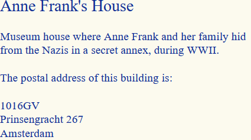

# HTML
## Introductie
HTML is een specificatie van het W3C [[html5]] om gegevens gestructureerd aan te bieden, voor ontsluiting op het web. HTML is vooral bekend als de standaard voor webpagina's. Zoekmachines kunnen HTML goed indexeren.

Geodata in HTML kan op verschillende manieren gepubliceerd worden. Een HTML pagina kan de geometrie zelf bevatten en visualiseren. Dit wordt gedaan met de hulp van (gestandaardiseerde) webtechnologie als CSS, JavaScript, SVG / web canvas. Hiermee kan de onderliggende data op dynamische wijze geladen en bekeken worden op een web pagina. En steeds meer APIs leveren ook HTML representaties van geo-objecten op. Zo is in de core van OGC API Features [[OAPIF]] [HTML een aanbevolen formaat](http://docs.opengeospatial.org/is/17-069r3/17-069r3.html#_requirements_class_html) voor representatie van geodata. Aangezien HTML zelf geen ondersteuning biedt voor geodata (het kent geen aparte elementen voor geometrieën), zal de data via libraries en tools van tevoren verwerkt moeten worden voor visualisatie doeleinden. 

Het is echter wel mogelijk om de geometrie gestructureerd op te nemen in een HTML pagina, door middel van een zogenaamde annotatie. Met een annotatie beschrijf je de geodata op zo'n manier dat het zoekmachines toestaat de data op de pagina te indexeren en mogelijk te combineren met andere data. Om de betekenis van de data te kunnen interpreteren worden hiervoor vocabulaires gebruikt. Annotaties in HTML zijn vaak volgens het begrippenkader van [Schema.org](https://schema.org/) opgesteld, een populair vocabulair waarmee zoekmachines goed overweg kunnen. Slechts enkele eenvoudige geometrietypen kunnen worden beschreven met Schema.org: 
- punt: `schema:GeoCoordinates` (met properties `schema:latitude` en `schema:longitude`)
- lijnen: `schema:GeoShape` (met property `schema:line`) 
- vlak: `schema:GeoCircle` of `schema:GeoShape` (met property `schema:box`, `schema:circle` of `schema:line`)
 Het is ook mogelijk om een hoogtegetal op te nemen - zowel voor de geometrieën als voor deze `elevation` geldt dat het in WGS84 moet worden geleverd. De geometrie wordt meestal beschouwd als een vorm van metadata van de HTML pagina. Hoe dan ook, de annotaties die hiervoor nodig zijn kunnen op verschillende manieren verwerkt worden in de HTML. De annotaties kunnen direct verbonden worden met de content die getoont wordt op de pagina (middels microdata of RDFa), of data en inhoud kunnen apart gehouden worden door fragmenten van de data op te nemen die voor de gebruiker verborgen blijven (middels JSON-LD, bijvoorbeeld).

In HTML kunnen eenvoudig relaties gelegd worden met andere bronnen zoals begrippenkaders of gerelateerde geo-objecten. Als deze geo-objecten op dezelfde manier ook relaties leggen naar andere bronnen, kan dit nieuwe inzichten opleveren. 

## Overwegingen

| Vraag                                                                              | Antwoord | Toelichting |
|------------------------------------------------------------------------------------|----------|-------------|
| Is het format geospecifiek?                                                        | &#10005; |             |
| Is het format gebaseerd op algemene ict standaarden?                               | &#10003;  |  Ja, HTML is de standaard voor Web pagina's.           |
| Wordt het format ondersteund in GIS software?                                      | &#10005; | Wanneer we het hebben over HTML voor de uitwisseling van data wordt een dataset (meestal) niet in één webpage gepubliceerd, maar krijgt elk object een eigen pagina. Dit betekent dat verwerking van meer dan één object in een ander systeem (bijvoorbeeld in een GIS of inlezen in een database), lastig is.|
| Ondersteunt het format het uitdrukken van schema's, en validatie tegen dat schema? | &#10005; |             |
| Ondersteunt het format meerdere coordinaatsystemen?                                | &#10005; | Nee, maar voor het gestructureerd opnemen van geometrie / CRSen kunnen annotaties gebruikt worden, deze worden gedefinieerd in een begrippenkader. [Schema.org](https://schema.org/) is een gangbare begrippenkader voor HTML annotaties, en ondersteunt alleen WGS-84. Het is niet de enige mogelijkheid, maar het voordeel van Schema.org annotaties is dat zoekmachines makkelijker met deze informatie overweg kunnen.   |
| Ondersteunt het format 3D?                                                         | &#10005; | Nee, maar voor het gestructureerd opnemen van geometrie / CRSen kunnen annotaties vanuit een begrippenkader gebruikt worden. [Schema.org](https://schema.org/) is een gangbare begrippenkader, alleen ondersteunt deze geen 3D. |
| Ondersteunt het format alle simple features geometrieen?                           | &#65374;   | Nee, HTML ondersteunt geen geometrietypes vanzelf. Via een begrippenkader zou je een geometrie echter wel op gestructureerde wijze kunnen opnemen. [Schema.org](https://schema.org/) ondersteunt het gebruik van coördinaten (zie [GeoCoordinates](https://schema.org/GeoCoordinates)) en een beperkt aantal geometrietypen (zie [GeoShape](https://schema.org/GeoShape)).  |
| Ondersteunt het format andere ISO 19107 geometrie types?                           | &#10005; |             |
| Is het format geschikt voor grote volumes?                                         | &#10005; |             |
| Is het format geschikt om semantiek aan te koppelen / in uit te drukken?           | &#10003;  | Het is eenvoudig om gestructureerde data te combineren met tekst en en men kan linken aan begrippenkaders (zie [RDFa Primer](https://www.w3.org/TR/rdfa-primer/) voor meer informatie) |

<!-- ## Voordelen
- directe visualiatie / presentatie aan (eind)gebruikers van (object)informatie
- gestructureerde data in combinatie met tekst
- indexeerbaar door zoekmachines
- linken aan begrippenkaders -->

<!-- ## Beperkingen
- geometrietypen zeer beperkt
- ondersteuning voor andere CRSen dan WGS84 is niet gangbaar
- een volledige dataset downloaden, bijvoorbeeld om te combineren met een andere dataset, is lastiger
- verwerking van de geometrie in een ander systeem (zoals een GIS desktop systeem) is lastig -->

## Voorbeeld

<aside class="example ds-selector-tabs" title="Voorbeelden van geometrie voor HTML">

	De voorbeelden hieronder tonen aan hoe je met geodata om kan gaan in HTML. Het Schema.org vocabulair wordt aangeraden wanneer men data in HTML wil annoteren, omdat de data op deze manier indexeerbaar is door zoekmachines. Echter sluit dit het gebruik van andere vocabulaires niet uit. Wanneer de RDFa of JSON-LD serialisaties worden toegepast, is het ook mogelijk uit de geanoteerde HTML Linked Data te extraheren (zie hier een visualisatie van de data uit de onderstaande voorbeelden). 
  

    <ul class="nav nav-tabs">
      <li class="tabs active"><a href="#html-geoshapes">HTML met RDFa (GeoShape) </a></li>
      <li class="tabs"><a href="#html-jsonld">HTML met JSON-LD (GeoShape) </a></li>          	
      <li class="tabs"><a href="#html-text">Visualisatie</a></li>
    </ul>
    

      

        Je zou de volgende text kunnen bekijken wanneer je de HTML met RDFa annotaties in een browser probeert te renderen (hoe de text er precies uit komt te zien is afhankelijk van de styling regels die worden toegepast).
        

    

      

      	Dit voorbeeld toont geodata volgens het Schema.org vocabulair, zoals je het in een HTML zou kunnen verwerken (met annotaties in RDFa).
        <pre>
&lt;div vocab="http://schema.org/" 
typeof="LandmarksOrHistoricalBuildings" 
about="http://www.ldproxy.net/bag/inspireadressen/inspireadressen.3329155"&gt;
    &lt;span property="name"&gt;Anne Frank's House 
    &lt;a property="url" href="http://www.ldproxy.net/bag/inspireadressen/inspireadressen.3329155"&gt;(INSPIRE object 3329155)
    &lt;/a&gt;&lt;/span&gt;&lt;span property="description"&gt; Museum house where Anne Frank & her family hid from the Nazis in a secret annex, during WWII.&lt;/span&gt;
    &lt;span&gt;The postal address of this building is:&lt;/span&gt;
    &lt;div property="location" typeof="Place"&gt;
		&lt;div property="address" typeof="PostalAddress"&gt;
	        &lt;span property="postalCode"&gt;1016GV&lt;/span&gt;
	        &lt;span property="streetAddress"&gt;Prinsengracht 267&lt;/span&gt;
	        &lt;span property="addressLocality"&gt;Amsterdam&lt;/span&gt;
    	&lt;/div&gt;
    	&lt;div property="geo" typeof="GeoShape"&gt;
      		&lt;meta property="polygon" content="52.375108,4.884235 52.375153,4.884276 
		                  52.375159,4.884257 52.375254,4.883981 
		                  52.375109,4.883850 52.375075,4.883819 
		                  52.374979,4.884104 52.374965,4.884143 
		                  52.375035,4.884207 52.375016,4.884263 
		                  52.374996,4.884320 52.374926,4.884255 
		                  52.374901,4.884329 52.375034,4.884451 
		                  52.375108,4.884235"&gt;
          	&lt;meta&gt;
      	&lt;/div&gt;
    &lt;/div&gt;
&lt;/div&gt;
		</pre>
      

      

      	Wanneer je de data liever niet vermengd met de inhoud van de HTML, dan kun je het ook met de JSON-LD serialisatie opnemen, in een script tag. Het voordeel van deze benadering is dat het gebruik maakt van een format waar ontwikkelaars vaker ervaring mee hebben. Wel is het belangrijk om rekening te houden met best practices: [Spatial Data on the Web Best Practice 2](https://www.w3.org/TR/sdw-bp/#bp-indexable) raadt aan om HTML representaties van geodata begrijpbaar te maken voor gebruikers, en dus niet alleen voor zoekmachines.      	
      	<pre>
&lt;script type="application/ld+json"&gt;      		
{
  "@context": [
  "https://schema.org/",
   {"gsp": "http://www.opengeospatial.org/standards/geosparql/",
  "geojson": "https://purl.org/geojson/vocab#",
  "coordinates": {
    "@container": "@list",
    "@id": "geojson:coordinates"
      }
     }
  ],
  "@type": "LandmarksOrHistoricalBuildings",
   "url": "http://www.ldproxy.net/bag/inspireadressen/inspireadressen.3329155",
  "name": "Anne Frank's House",
  "description": "Museum house where Anne Frank & her family hid from the Nazis in a secret annex, during WWII.",
  "location": {
    "@type": "Place",  
    "address": {
      "@type": "PostalAddress",
      "streetAddress": "Prinsengracht 267",
      "addressLocality": "Amsterdam",
      "postalCode": "1016GV"
    },
    "geo": {
      "@type": "GeoShape",
      "polygon": "52.375108,4.884235 52.375153,4.884276 52.375159,4.884257 52.375254,4.883981 52.375109,4.883850 52.375075,4.883819 52.374979,4.884104 52.374965,4.884143 52.375035,4.884207 52.375016,4.884263 52.374996,4.884320 52.374926,4.884255 52.374901,4.884329 52.375034,4.884451 52.375108,4.884235"
    }
  }
}
&lt;/script&gt;
		</pre>
      
 
    

  

</aside>