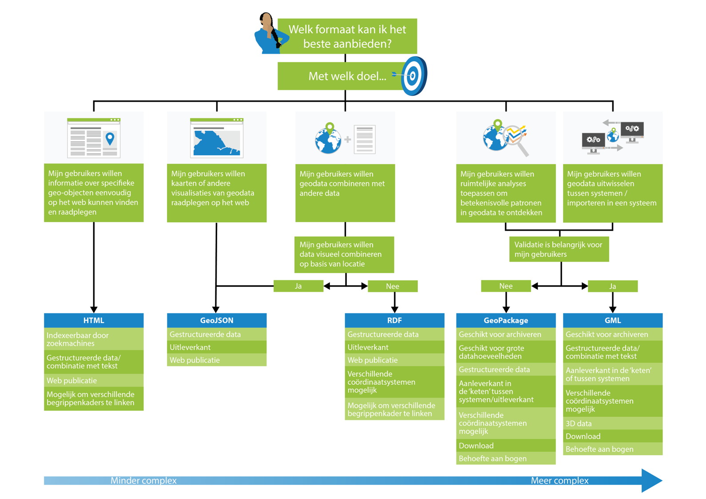

# Keuzehulp bestandsformaten

Bij de keuze voor de juiste encoding speelt de beoogde toepassing een belangrijke rol. vaak zal het mogelijk en ook nodig zijn om meerdere toepassingen te ondersteunen met een publicatie van geodata. Hierbij is de keuze van de meest geschikte encoding van groot belang. Het kan in sommige gevallen nodig of handig zijn om de data in verschillende encodings aan te bieden. Dit betekent dat de beste oplossing kan variëren, en afhankelijk is van overwegingen die gemaakt zullen moeten worden wat betreft een aantal aspecten. 

De belangrijkste aspecten (die dus invloed kunnen hebben op de keuze voor een format) lichten we hieronder kort toe. Na deze toelichting vatten we de aspecten samen en brengen ze met elkaar in verband. 

## Aspecten die een rol spelen bij de keuze

### Aanleveren versus uitleveren van data
Bij het kiezen van het juiste formaat, maakt het veel verschil of de data wordt uitgewisseld tussen softwaresysteem in een keten, bijvoorbeeld bij het aanleveren aan een landelijke voorziening voor data; of dat de data wordt aangeboden aan gebruikers. In een keten heb je altijd te maken met bekende gebruikers, en vaste afspraken die binnen de keten voor gegevensuitwisseling zijn gemaakt. Een partij die binnen een keten acteert heeft doorgaans een langdurig belang en zal dus meer bereid zijn tot het doen van een investering in tijd en/of geld om de data te kunnen uitwisselen. Het kan dan gerechtvaardigd zijn om een wat moeilijker te hanteren formaat te kiezen, als dat opweegt tegen voordelen die dat specifieke formaat heeft. Bij het aanbieden van data aan gebruikers, vaak als open data, is dit veel minder het geval. Datagebruikers hebben vaak beperkt tijd om met een bestand aan de slag te gaan. 

### Bekende versus onbekende gebruiker
Bij het aanleveren van data aan een landelijke voorziening heb je per definitie een bekende gebruiker: er zijn afspraken tussen verzender en ontvanger van de data. Bij het uitleveren van data is dit niet per definitie het geval. Er kan sprake zijn van bekende gebruikers: partijen die bijvoorbeeld een abonnement op de data hebben of waarvan bekend is dat ze de data afnemen. Maar het kan ook zijn dat de data voor iedereen beschikbaar is zonder verder contact met de data aanbieder. In dat geval kunnen er gebruikers zijn met allerlei verschillende kennisniveau's, applicaties en behoeftes. Denk hierbij bijvoorbeeld aan web developers (applicatiebouwers), data scientists en data journalisten. Om breed gebruik van data te bevorderen is het dan verstandig om de data zo laagdrempelig mogelijk aan te bieden, dus in bij een breed publiek bekende dataformaten en/of formaten waarvoor brede ondersteuning in tooling bestaat.

### GIS-gebruikers of andere gebruikers
Nog een aspect dat met gebruikers te maken heeft, is de vraag of het om GIS gebruikers gaat. De huidige GIS systemen kunnen niet alle lichte formaten, die we in deze handreiking beschrijven, aan. Als (een deel van) het publiek van de gepubliceerde data wel de behoefte heeft om data in een GIS in te lezen, om bijvoorbeeld ruimtelijke analyses te kunnen doen, moet hier rekening mee gehouden worden. 

### Archivering versus direct gebruik
Bij archivering is een belangrijk basisconcept dat vorm, inhoud en structuur van archiefbescheiden behouden moeten blijven of tenminste reproduceerbaar zijn. Voor data die gearchiveerd moeten worden zijn daarom afwegingen zoals langdurige ondersteuning, gedocumenteerde standaarden en open formaten van extra belang. Mogelijk moet er ook voldaan worden aan de Archiefwet.

### Ondersteuning in algemene tooling
Als het gaat om de aanleverkant in een keten, is er meestal specifieke ondersteuning voor het gekozen uitwisselformaat in de keten geimplementeerd. Soms kan er echter toch behoefte zijn aan ondersteuning in tooling, die niet onderdeel van de keten is maar wel toegevoegde waarde heeft in het werkproces van de zender of de ontvanger van de data. 

<aside class="issue">[deze behoeft nog extra toelichting]</aside>

### Validatie
Validatie, het controleren van de datastructuur en -inhoud tegen vooraf afgesproken regels, is vooral belangrijk aan de aanleverkant van landelijke datavoorzieningen. Men wil immers de kwaliteit borgen van de landelijke dataset en zorgen dat alleen correcte data wordt ingelezen. Maar er zijn ook andere situaties denkbaar waarin validatie belangrijk is. 

Validatie kan zich richten op verschillende aspecten:
- Validatie van een vooraf afgesproken datastructuur (model / grammatica / schema)
- Validatie van business rules (regels over de inhoud en afhankelijkheden tussen onderdelen van de data)
- Validatie van geometrieën

Al deze validatie-aspecten worden in wisselende mate ondersteund door de verschillende formaten. 

### Uitleveren van schema's
In sommige situaties is het gewenst om de afspraken over datastructuur en -inhoud (ook wel: *schema's*) vast te leggen in machine-leesbare vorm en dit machine-leesbare schema te delen met de ontvangers van data. Dit is niet bij alle lichte formaten mogelijk. 

### Out of the box validatie
Als je een dataset wilt valideren kun je dit altijd uitprogrammeren, maar vaak biedt het voordelen om zonder programmeerwerk te kunnen valideren. Dit is bijvoorbeeld bij op XML gebaseerde formaten mogelijk omdat het uitdrukken van dataschema's een goed geïmplementeerd onderdeel van de standaard is. 

<aside class="issue">[Dit is wellicht niet goed als aparte vraag maar zou gecombineerd kunnen worden met 3.6 Validatie. </aside>

### Nauwkeurige data
Als er sprake is van nauwkeurige geometrische data, kan dit ook gevolgen hebben voor de formaatkeuze. Dit hangt samen met coordinaatreferentiesystemen. Sommige formaten ondersteunen alleen het WGS-84 coördinaatstelsel, waarmee het niet mogelijk is om coordinaten in Nederland net zo nauwkeurig uit te drukken als bijvoorbeeld in het Rijksdriehoekstelsel. 

<aside class="note">De data aanbieder zou goed moeten nadenken of het ook nodig is om de data zo nauwkeurig als mogelijk te publiceren. Dit hangt af van de gebruikersbehoefte. Ontwikkelaars die met de data in web viewers aan de slag gaan, werken over het algemeen met Web Mercator (een projectie van WGS84). Bezoekers van hun websites willen bijvoorbeeld weten 'of er een pinautomaat in de buurt is' en hebben daarbij geen last van een afwijking van een paar meter. Niet-geo-experts weten vaak niet eens dat er verschillende coordinaatreferentiesystemen zijn en waarom. Voor de meeste use cases hebben zij deze kennis - en nauwkeurige geodata - ook helemaal niet nodig.</aside>

### Simpele geometrie
GIS standaarden en (in mindere mate) -tooling ondersteunen niet alleen rechttoe rechtaan 0, 1 of 2 dimensionale geometrie in de vorm van punten, lijnen en vlakken maar soms ook exotischere vormen zoals kromme lijnen (splines, cirkels, bogen, ellipses), driehoeken, 3D volumes, etc. In Nederland hanteren we het Simple Feature profiel (zie [[gimeg]] hoofdstuk 3), maar ondersteuning van bogen en 3D volumes is voor sommige use cases wel nodig. In lichte formaten is over het algemeen beperkte ondersteuning: soms alleen punten, soms ook lijnen en vlakken, en in een enkel geval ook bogen en/of volumes. 

### Bogen en volumes
Als de toepassing het nodig maakt om bogen en/of 3D volumes in de data uit te wisselen, moet er extra gelet worden op ondersteuning hiervoor bij de keuze van het uitwisselformaat.

### Datavolume
Bij geodata kan men te maken hebben met grote datavolumes. Het woord "groot" is hierbij lastig te kwantificeren, en wat een groot bestand gevonden wordt kan ook veranderen in de loop der jaren. Maar een bestand van bijvoorbeeld 500MB of 1GB kan momenteel toch wel 'groot' genoemd worden. 

<aside class="example">Een BGT GML bestand van één gemeente kan al gauw 1 of 2 GB groot zijn. Zie bijvoorbeeld het [voorbeeldbestand Amersfoort](https://www.geonovum.nl/uploads/documents/Amersfoort_GML_20132211.zip).</aside>

Het ene formaat is geschikter voor grote datavolumes dan het andere. Het tegenovergestelde geldt ook: sommige formaten hebben relatief veel overhead en zijn daarom minder geschikt voor het uitwisselen van een klein bestandje via een API. 

### Semantiek
Het vastleggen en uitwisselen van informatie over de betekenis (semantiek) van de data wordt in wisselende mate ondersteund door de verschillende formaten. Of het van belang is hangt af van de situatie; bij data uitwisseling tussen partijen die elkaar kennen speelt dit niet zo, omdat deze kennis bij de ontvanger op de een of andere manier al aanwezig is. Voor onbekende gebruikers is het vaak belangrijker om de betekenis te kunnen achterhalen. Afkortingen of jargon zijn voor hen lastig te doorgronden. Ook voor vindbaarheid in zoekmachines is semantiek belangrijk: zoekmachines nemen dit mee in hun indexering zodat zoektermen die gebruikers invoeren betekenisvolle resultaten opleveren.

### Gestructureerde semantiek
Informatie over de betekenis, ofwel semantiek, kan op verschillende manieren worden vastgelegd. Dit kan een simpel PDF document of excel bestand zijn, of een website met uitleg; er zijn ook machineleesbare formaten zoals RDFS en SKOS. In de meeste formaten is er weinig of geen ondersteuning voor het gestructureerd vastleggen van semantiek.

### Samenvatting: de aspecten in samenhang
Deze aspecten zijn samen te vatten in de volgende vragen, waarbij ook de afhankelijkheden tussen de vragen zijn meegenomen:

**1. Gaat het om het aanleveren van data (in ‘keten of tussen systemen), of het uitleveren van data aan eindgebruikers?**
- In geval van uitleveren:
-- 	**Is de gebruiker bekend of onbekend?** 
--		In geval van bekend:
--	-		**Gaat het om GISers of niet-geo developers?**

- In geval van aanleveren:
--	**Wordt de data (door de andere partij) gearchiveerd of direct gebruikt?**
--		In geval van direct gebruikt:
--	-		**Heeft de partij behoefte aan ondersteuning in algemenere tooling?**

**2. Is validatie erg belangrijk?**
- Zo ja:
--	**Is het belangrijk om schema’s te kunnen leveren aan partijen / gebruikers?**
--	**Is het belangrijk om out-of-the-box te kunnen valideren tegen het schema?**

**3. Is de nauwkeurigheid van de data belangrijk?**

**4. Welke geometriesoorten worden uitgewisseld – alleen simple features of ook andere ISO 19107 types?**
- In geval alleen simple features: 
--	**Zijn bogen of 3D geometrieën aanwezig?**

**5. Gaat het om grote of kleine datahoeveelheden?**
**6. Is semantiek belangrijk (gaat het om meer dan de uitwisseling van geometrieën)?**
- Zo ja:
--	**Moet de semantiek op gestructureerde wijze worden vastgelegd?**

De antwoorden op de bovengenoemde vragen geven inzicht in welke aspecten een belangrijke rol spelen voor de beoogde toepassing. Met deze informatie kan de lezer de tabellen in hoofdstuk 4-8 nagaan, waarbij gericht kan worden gekeken naar welke formaten het beste aansluiten op de behoeften die uit de antwoorden naar voren zijn gekomen. Let op dat dit geen allesomvattende vragenlijst is, voor bepaalde toepassingen kan het belangrijk zijn om dieper in te gaan op sommige vragen – dit is buiten scope voor deze handreiking. 
Hoewel elke toepassing tot andere antwoorden kan leiden (en dus andere keuzes), zijn er een aantal generieke toepassingen waarvoor een specifieke encoding veel geschikter is.  Om de lezer te helpen bieden we een visuele keuzehulp aan die deze generieke toepassingen beschrijft en een overzicht geeft van de belangrijkste aspecten die, in het kader van de toepassing, leiden tot het keuze voor een bepaalde encoding.

De generieke toepassingen:

- Web pagina's waarop mensen informatie kunnen vinden over geo-objecten
- Kaarten of andere visualisaties van geodata die gepubliceerd worden op het web
- Data integratie - het combineren van geodata met andere data
- Ruimtelijke analyses - het ontdekken van betekenisvolle patronen in geodata
- Uitwisselen van geodata tussen systemen

  <a class="image-link" href="#html" title="HTML-keuze">

</a><a class="image-link" href="#geojson" title="GeoJSON-keuze">

</a><a class="image-link" href="#rdf" title="RDF-keuze">

</a><a class="image-link" href="#geopackage" title="GeoPackage-keuze">

</a><a class="image-link" href="#gml" title="GML-keuze">

</a>  

<!-- Het hoofddoel moet zijn om de geodata te publiceren op een manier die voor gebruikers gemakkelijk te ontcijferen en te gebruiken is. Daarbij is het belangrijk om in je achterhoofd te houden op welke doelgroepen de datapublicatie gericht is en welk doel zij hebben met hun gebruik van de data. Uit het beoogd gebruik valt af te leiden wat voor kenmerken de data moet hebben. Bijvoorbeeld:

- het volume (bestandsgrootte) van de data
- hoe veel ruimtelijke dimensies het bestrijkt (punten, lijnen, vlakken, 3D)
- wat voor gebied het bestrijkt (één gebouw, een stad, een heel land)
- hoe vaak de data verandert
- de nauwkeurigheid die de dataset heeft én de nauwkeurigheid die gebruikers nodig hebben -->

<!-- Bron: <a href ="https://www.w3.org/TR/sdw-bp/#semantic-thing">Spatial Data on the Web Best Practice 4: Use spatial data encodings that match your target audience</a> [[sdw-bp]]. -->

<aside class="note">
Om de lezer te helpen willen we het mogelijk maken om de vragenlijst in te vullen en, gebaseerd op het resultaat, een bepaalde view op de tabellen in hoofdstuk 4-8 te activeren. Hiermee zou lezer in een oogopslag kunnen zien wat de voordelen en nadelen zijn van elke encoding, gericht op de toepassing(en).  Wanneer de lezer op een van de generieke toepassingen in het diagram klikt is de view op de generieke toepassing gebaseerd. </aside>

## Overzicht van de formaten

### HTML
Positionering:
- Web publicatie en directe visualiatie
- Indexeerbaar door zoekmachines
- Combinatie met tekst
- Mogelijk om begrippenkaders te linken

### GeoJSON
Positionering:
- Aan de uitleverkant
- In Web visualisaties en APIs
- Voor de onbekende gebruiker
- Voor kleine aanleveringen (bijvoorbeeld terugmelden)
- Niet als authentieke bron
- Als er geen ander coördinaatreferentiesysteem dan WGS 84 noodzakelijk is

### GeoPackage
Positionering:
- Overzetten van data van systeem a naar systeem b
- Archivering
- Grote volumes
- Download voor gebruikers

### GML
Positionering:
- Archivering van data
- In combinatie met tekstgerichte uitwisseling (dan is XML namelijk geschikter dan JSON)
- In gevallen waar nauwkeurige validatie van de bestandstructuur en -inhoud heel belangrijk is

### RDF (linked data)
Positionering:
- Publiceren van data op het web, in de meest rijke vorm
- Inclusief semantiek
- Voor integratie van data uit meerdere verschillende bronnen
- Voor slim bevragen van data, waarbij geo en niet-geo aspecten een rol kunnen spelen
