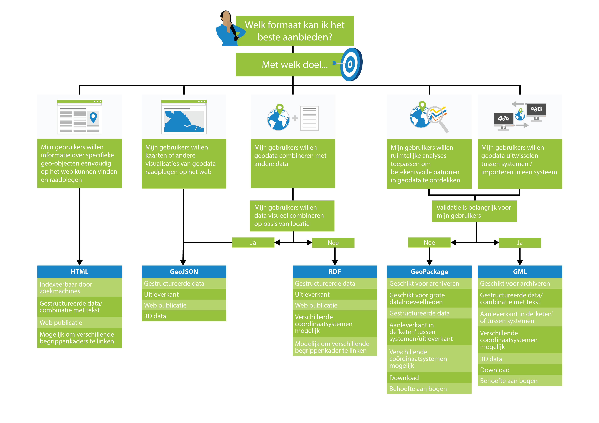

# Keuzehulp bestandsformaten

Bij de keuze voor de juiste encoding speelt de beoogde toepassing een belangrijke rol. vaak zal het mogelijk en ook nodig zijn om meerdere toepassingen te ondersteunen met een publicatie van geodata. Hierbij is de keuze van de meest geschikte encoding van groot belang. Het kan in sommige gevallen nodig of handig zijn om de data in verschillende encodings aan te bieden. Dit betekent dat de beste oplossing kan variëren, en afhankelijk is van overwegingen die gemaakt zullen moeten worden wat betreft een aantal aspecten. Een aantal belangrijke aspecten (die dus invloed kunnen hebben op de keuze voor een format) zijn samengevat in de volgende vragen:

**1. Gaat het om het aanleveren van data (in ‘keten of tussen systemen), of het uitleveren van data aan eindgebruikers?**
- In geval van uitleveren:
-- 	**Is de gebruiker bekend of onbekend?** 
--		In geval van bekend:
--	-		**Gaat het om GISers of niet-geo developers?**

- In geval van aanleveren:
--	**Wordt de data (door de andere partij) gearchiveerd of direct gebruikt?**
--		In geval van direct gebruikt:
--	-		**Heeft de partij behoefte aan ondersteuning in algemenere tooling?**

**2. Is validatie erg belangrijk?**
- Zo ja:
--	**Is het belangrijk om schema’s te kunnen leveren aan partijen / gebruikers?**
--	**Is het belangrijk om out-of-the-box te kunnen valideren tegen het schema?**

**3. Is de nauwkeurigheid van de data belangrijk?**

**4. Welke geometriesoorten worden uitgewisseld – alleen simple features of ook andere ISO 19107 types?**
- In geval alleen simple features: 
--	**Zijn bogen of 3D geometrieën aanwezig?**

**5. Gaat het om grote of kleine datahoeveelheden?**
**6. Is semantiek belangrijk (gaat het om meer dan de uitwisseling van geometrieën)?**
- Zo ja:
--	**Moet de semantiek op gestructureerde wijze worden vastgelegd?**

De antwoorden op de bovengenoemde vragen geven inzicht in welke aspecten een belangrijke rol spelen voor de beoogde toepassing. Met deze informatie kan de lezer de tabellen in hoofdstuk 4-8 nagaan, waarbij gericht kan worden gekeken naar welke formaten het beste aansluiten op de behoeften die uit de antwoorden naar voren zijn gekomen. Let op dat dit geen allesomvattende vragenlijst is, voor bepaalde toepassingen kan het belangrijk zijn om dieper in te gaan op sommige vragen – dit is buiten scope voor deze handreiking. 
Hoewel elke toepassing tot andere antwoorden kan leiden (en dus andere keuzes), zijn er een aantal generieke toepassingen waarvoor een specifieke encoding veel geschikter is.  Om de lezer te helpen bieden we een visuele keuzehulp aan die deze generieke toepassingen beschrijft en een overzicht geeft van de belangrijkste aspecten die, in het kader van de toepassing, leiden tot het keuze voor een bepaalde encoding.

De generieke toepassingen:

- Web pagina's waarop mensen informatie kunnen vinden over geo-objecten
- Kaarten of andere visualisaties van geodata die gepubliceerd worden op het web
- Data integratie - het combineren van geodata met andere data
- Ruimtelijke analyses - het ontdekken van betekenisvolle patronen in geodata
- Uitwisselen van geodata tussen systemen

  <a class="image-link" href="#html" title="HTML-keuze">

</a><a class="image-link" href="#geojson" title="GeoJSON-keuze">

</a><a class="image-link" href="#rdf" title="RDF-keuze">

</a><a class="image-link" href="#geopackage" title="GeoPackage-keuze">

</a><a class="image-link" href="#gml" title="GML-keuze">

</a>  

<!-- Het hoofddoel moet zijn om de geodata te publiceren op een manier die voor gebruikers gemakkelijk te ontcijferen en te gebruiken is. Daarbij is het belangrijk om in je achterhoofd te houden op welke doelgroepen de datapublicatie gericht is en welk doel zij hebben met hun gebruik van de data. Uit het beoogd gebruik valt af te leiden wat voor kenmerken de data moet hebben. Bijvoorbeeld:

- het volume (bestandsgrootte) van de data
- hoe veel ruimtelijke dimensies het bestrijkt (punten, lijnen, vlakken, 3D)
- wat voor gebied het bestrijkt (één gebouw, een stad, een heel land)
- hoe vaak de data verandert
- de nauwkeurigheid die de dataset heeft én de nauwkeurigheid die gebruikers nodig hebben -->

<!-- Bron: <a href ="https://www.w3.org/TR/sdw-bp/#semantic-thing">Spatial Data on the Web Best Practice 4: Use spatial data encodings that match your target audience</a> [[sdw-bp]]. -->

<aside class="note">
Om de lezer te helpen willen we het mogelijk maken om de vragenlijst in te vullen en, gebaseerd op het resultaat, een bepaalde view op de tabellen in hoofdstuk 4-8 te activeren. Hiermee zou lezer in een oogopslag kunnen zien wat de voordelen en nadelen zijn van elke encoding, gericht op de toepassing(en).  Wanneer de lezer op een van de generieke toepassingen in het diagram klikt is de view op de generieke toepassing gebaseerd. </aside>

## HTML
Positionering:
- Web publicatie en directe visualiatie
- Indexeerbaar door zoekmachines
- Combinatie met tekst
- Mogelijk om begrippenkaders te linken

## GeoJSON
Positionering:
- Aan de uitleverkant
- In Web visualisaties en APIs
- Voor de onbekende gebruiker
- Voor kleine aanleveringen (bijvoorbeeld terugmelden)
- Niet als authentieke bron
- Als er geen ander coördinaatreferentiesysteem dan WGS 84 noodzakelijk is

## GeoPackage
Positionering:
- Overzetten van data van systeem a naar systeem b
- Archivering
- Grote volumes
- Download voor gebruikers

## GML
Positionering:
- Archivering van data
- In combinatie met tekstgerichte uitwisseling (dan is XML namelijk geschikter dan JSON)
- In gevallen waar nauwkeurige validatie van de bestandstructuur en -inhoud heel belangrijk is

## RDF (linked data)
Positionering:
- Publiceren van data op het web, in de meest rijke vorm
- Inclusief semantiek
- Voor integratie van data uit meerdere verschillende bronnen
- Voor slim bevragen van data, waarbij geo en niet-geo aspecten een rol kunnen spelen
