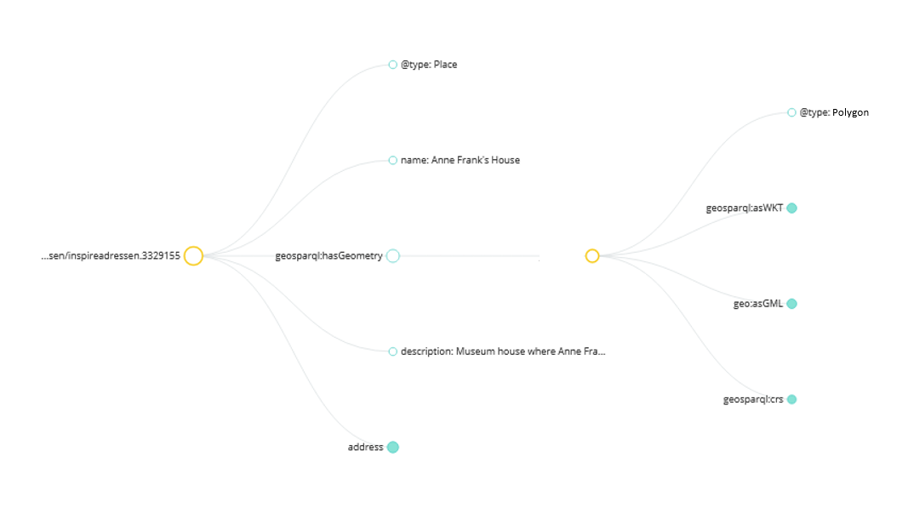

## RDF

### Introductie

RDF wordt steeds meer gebruikt als uitwissel- en publicatiemechanisme voor geo-informatie op basis van Linked Data. RDF vormt de basis voor een set standaarden die bijdragen aan het gebruik en de publicatie van Linked Data. De afkorting RDF [[rdf11-concepts]] staat voor Resource Description Framework en is een standaard voor het representeren van informatie op het web als linked data, zodanig dat deze beschikbaar gemaakt kunnen worden in machineleesbare vorm op het web, niet als download maar als web pagina's, en daardoor ook beter bruikbaar zijn over sectorale grenzen heen. Het is dus niet een encoding maar een manier om hergebruik van data bij de bron te stimuleren, door koppelingen via persistente URI’s te ondersteunen. Stukjes data uit verschillende bronnen kunnen dan op een eenduidige manier met elkaar worden verbonden - zo'n koppeling wordt ook wel een 'triple' genoemd. Door individuele gegevens uit allerlei bronnen met elkaar te koppelen ontstaat een web van data. Om het visueler te maken: de structuur die onstaat bij het koppelen van triples is dat van een graaf, waarbij de lijnen relaties beschrijven tussen twee dingen (waarvan minstens één een URI heeft). 

Er zijn meerdere technische RDF encodings zoals bijvoorbeeld RDF-XML [[rdf-syntax-grammar]] en [[turtle]]. Naast deze encodings is het ook mogelijk om RDF triples op andere manieren uit te drukken - zoals via JSON-LD of RDFa, bijvoorbeeld. RDFa wordt gebruikt om HTML uit te breiden met annotaties, welke ook als RDF data kan worden geïnterpreteerd. Met JSON-LD kan JSON worden omgezet naar triples middels de toevoeging van een `@context` tag (waarmee een JSON-LD parser de JSON als Linked Data kan interpreteren). Wanneer een gebruiker data uit verschillende bronnen wil afnemen en combineren kan dit van nut zijn - alle informatie is dan concreet gedefinieerd en vindbaar. En als dit niet nodig is, kan de `@context` tag genegeerd worden. 

Hoe geometrie in RDF moet worden uitgedrukt is beschreven in vocabulaires. De OGC GeoSPARQL standaard [[geosparql]], zoals de naam al doet vermoeden, specificeert een extensie op de SPARQL query language, zodat gebruikers geodata in RDF kunnen bevragen. Het bevat ook een beknopte vocabulaire voor geo-objecten en geometrie. Dit vocabulaire kan men gebruiken om geo-objecten en hun geometrie in RDF vast te leggen.

## Voorbeelden

<aside class="example ds-selector-tabs" title="Voorbeelden van geometrie voor HTML" style="overflow-x: hidden;">

  

    <ul class="nav nav-tabs">
      <li class="tabs active"><a href="#rdf-turtle">RDF in Turtle (GeoSPARQL)</a></li>
      <li class="tabs"><a href="#rdf-jsonld">RDF in JSON-LD (GeoSPARQL)</a></li>
      <li class="tabs"><a href="#rdf-visual">visualisatie</a></li>            
    </ul>
    

      

      	Voorbeeld van een JSON-LD fragment met geometrie conform het GeoSPARQL vocabulair - in zowel WKT als GML, beide worden ondersteund in GeoSPARQL 1.0. 
        <pre>
 {
   "@context" : {
     "@vocab" : "http://schema.org/",
     "geosparql": "http://www.opengis.net/ont/geosparql#"
   },
     "@type" : "Place",
  	 "@id" : "http://www.ldproxy.net/bag/inspireadressen/inspireadressen.3329155",
     "name" : "Anne Frank's House",
     "geosparql:hasGeometry" : {
       "@type": "http://www.opengis.net/ont/sf#Polygon",
       "geosparql:asWKT": {
           "@type": "http://www.opengis.net/ont/geosparql#wktLiteral",
           "@value": "POLYGON((52.375108 4.884235, 52.375153 4.884276, 52.375159 4.884257, 52.375254 4.883981, 52.375109 4.883850, 52.375075 4.883819, 52.374979 4.884104, 52.374965 4.884143, 52.375035 4.884207, 52.375016 4.884263, 52.374996 4.884320, 52.374926 4.884255, 52.374901 4.884329, 52.375034 4.884451, 52.375108 4.884235))"
           },
       "geo:asGML": {
           "@type": "http://www.opengis.net/ont/geosparql#gmlLiteral",
           "@value": "
             &lt;gml:Polygon&gt;
                &lt;gml:exterior&gt;
                   &lt;gml:LinearRing&gt;
                      &lt;gml:posList&gt;
                         52.375108 4.884235, 52.375153 4.884276, 52.375159 4.884257, 52.375254 4.883981, 52.375109 4.883850, 52.375075 4.883819, 52.374979 4.884104, 52.374965 4.884143, 52.375035 4.884207, 52.375016 4.884263, 52.374996 4.884320, 52.374926 4.884255, 52.374901 4.884329, 52.375034 4.884451, 52.375108 4.884235
                       &lt;/gml:posList&gt;
                   &lt;/gml:LinearRing&gt;
                &lt;/gml:exterior&gt;
             &lt;/gml:Polygon&gt;"
           },
       "geosparql:crs": {
             "@id": "http://www.opengis.net/def/crs/OGC/1.3/CRS84"
         }  
   },
   "description": "Museum house where Anne Frank & her family hid from the Nazis in a secret annex, during WWII.",
     "address" : {
       "@type" : "PostalAddress",
       "streetAddress" : "Prinsengracht 267",
       "addressLocality" : "Amsterdam",
       "postalCode" : "1016GV"
     }		  
 }
		</pre>        
      

      

        De grafische representatie van de data uit de gebruikte voorbeelden. Voor een interactieve versie kan de data bekeken worden in [de JSON-LD playground](https://tinyurl.com/p2t3pnt2)
        

    

      

      	Dezelfde data zoals getoond in  <a href="rdf-jsonld">het JSON-LD voorbeeld</a>, maar dan volgens het veelgebruikte Terse RDF Triple Language (Turtle) formaat.
      	<pre>
@prefix schema: &lt;http://schema.org/> .
@prefix geosparql: &lt;http://www.opengis.net/ont/geosparql#> .
&lt;http://www.ldproxy.net/bag/inspireadressen/inspireadressen.3329155>
  a schema:Place ;
  schema:address [
    a schema:PostalAddress ;
    schema:addressLocality "Amsterdam"^^xsd:string ;
    schema:postalCode "1016GV"^^xsd:string ;
    schema:streetAddress "Prinsengracht 267"^^xsd:string
  ] ;
  schema:description "Museum house where Anne Frank & her family hid from the Nazis in a secret annex, during WWII."^^xsd:string ;
  geosparql:hasGeometry [ a &lt;http://www.opengis.net/ont/sf#Polygon> ;
            geosparql:asGML "&lt;gml:Polygon>&lt;gml:exterior>&lt;gml:LinearRing>&lt;gml:posList>52.375108 4.884235, 52.375153 4.884276, 52.375159 4.884257, 52.375254 4.883981, 52.375109 4.883850, 52.375075 4.883819, 52.374979 4.884104, 52.374965 4.884143, 52.375035 4.884207, 52.375016 4.884263, 52.374996 4.884320, 52.374926 4.884255, 52.374901 4.884329, 52.375034 4.884451, 52.375108 4.884235&lt;/gml:posList>&lt;/gml:LinearRing>&lt;/gml:exterior>&lt;/gml:Polygon>"^^geosparql:gmlLiteral ;
            geosparql:asWKT "POLYGON((52.375108 4.884235, 52.375153 4.884276, 52.375159 4.884257, 52.375254 4.883981, 52.375109 4.883850, 52.375075 4.883819, 52.374979 4.884104, 52.374965 4.884143, 52.375035 4.884207, 52.375016 4.884263, 52.374996 4.884320, 52.374926 4.884255, 52.374901 4.884329, 52.375034 4.884451, 52.375108 4.884235))"^^geosparql:wktLiteral ;
            geosparql:crs &lt;http://www.opengis.net/def/crs/OGC/1.3/CRS84> ] ;
  schema:name "Anne Franks House"^^xsd:string .
		</pre>
      

    

  

</aside>

<!-- &#10003;  &#10005;  &#65374; 
 --> -->
 
## Keuze-aspecten
De volgende tabel geeft aan hoe RDF scoort op de aspecten die een rol spelen bij de keuze voor een bestandsformaat.

| Vraag                                                                              | Antwoord | Toelichting |
|------------------------------------------------------------------------------------|----------|-------------|
| Is het format geospecifiek?                                                        | &#10005;  | Het is een algemene Webstandaard. In combinatie met de GeoSPARQL vocabulaire is er wel ondersteuning voor geo-informatie.            |
| Is het format gebaseerd op algemene ict standaarden?                               | &#10003;  | Ja, het is gebaseerd op W3C Linked Data standaarden            |
| Wordt het format ondersteund in GIS software?                                      | &#10005; |             |
| Ondersteunt het format het uitdrukken van schema's, en validatie tegen dat schema? | &#10003;  | Ja, via [[shacl]] shape expressions            |
| Ondersteunt het format meerdere coördinaatsystemen?                                | &#10003;  |             |
| Ondersteunt het format 3D?                                                         | &#10005; | Je kunt op zich 3D geometrie opnemen in de data, maar GeoSPARQL ondersteunt geen 3D bij ruimtelijke vragen.         |
| Ondersteunt het format alle simple features geometrieën?                           | &#10003;  |             |
| Ondersteunt het format andere ISO 19107 geometrie types?                           | &#10003;  | Ja, als je de GeoSPARQL GML serialisatie gebruikt            |
| Is het format geschikt voor grote volumes?                                         | &#65374;   | In triple stores is goede ondersteuning voor grote hoeveelheden geometrieën in de data, maar bij het uitwisselen is een RDF bestand geen heel geschikt format vanwege verbositeit            |
| Is het format geschikt om semantiek aan te koppelen / in uit te drukken?           | &#10003;  | Bij uitstek geschikt. Gebruik van RDF voor het publiceren van gestructureerde gegevens op het web maakt het mogelijk dat data over de grenzen van sectoren heen gekoppeld en geïntegreerd worden.             |

## Afspraken
In Nederland zijn er geen normatieve regels over het gebruik van RDF voor het uitwisselen van geometrie. 

Wel zijn er de volgende handvaten:
- RDF staat op de lijst met [aanbevolen standaarden](https://forumstandaardisatie.nl/open-standaarden/aanbevolen).
- De Aanzet tot een Nationale  URI-strategie [[NLURIStrategie]] beschrijft het in Nederland gehanteerde URI patroon.
- Het Linked Data profiel op NEN 3610 [[nen3610-linkeddata]] beschrijft hoe een linked data model van een NEN 3610 conform informatiemodel kan worden afgeleid.
- Voor het uitdrukken van geometrie in RDF gebruiken we de OGC GeoSPARQL Linked Data vocabulaire [[geosparql]]. 

### Geometrie encodings

Aangezien Linked Data op basis van vocabulaires werkt, kunnen geometrieën op verschillende wijzen worden vastgelegd, zo lang er maar een vocabulair voor is. Uiteraard is de beste oplossing afhankelijk van de toepassing. Schema.org wordt vaak gebruikt voor annotaties en indexatie van data door zoekmachines. GeoSPARQL daarentegendeel is geschikter wanneer ruimtelijke bevragingen gewenst zijn, WGS84 niet voldoet, of verschillende en gestandaardiseerde geometrietypes gebruikt worden (GeoSPARQL wordt ondersteund in een aantal RDF Triplestores). Om deze reden wordt OGC GeoSPARQL aangeraden voor gebruik bij het uitwisselen van geometrie in RDF. De geometrie kan volgens GeoSPARQL op twee manieren worden geserialiseerd:
- Als WKT, waarbij de Simple Feature geometrietypen uit ISO 19125 gebruikt kunnen worden (daardoor beperkt: geen 3D, geen bogen etc);
- Als GML, waarbij de ISO 19107 geometrietypen gebruikt kunnen worden.

JSON-LD kan wordt gebruikt als RDF encoding door de JSON data te voorzien van een context tag, waarmee RDF data kan worden afgeleid. Echter is er een beperking wanneer je geometrie in JSON opneemt, zoals het geval is met GeoJSON. De JSON-LD 1.0 specificatie staat het namelijk niet toe om 'list of lists' om te zetten naar Linked Data (zie [deze note](https://www.w3.org/TR/2014/REC-json-ld-20140116/#h_note_8)), en deze heb je om bepaalde geometrieën uit te drukken wel nodig. Om deze reden zal een processor conform JSON-LD 1.0 zulke geometrieën overslaan. 

Deze beperking is niet meer aanwezig in JSON-LD 1.1 (zie [dit voorbeeld](https://www.w3.org/TR/json-ld11/#example-82-specifying-that-a-collection-is-ordered-in-the-context)). Echter, JSON-LD 1.1 processors worden nog niet overal ondersteund. 